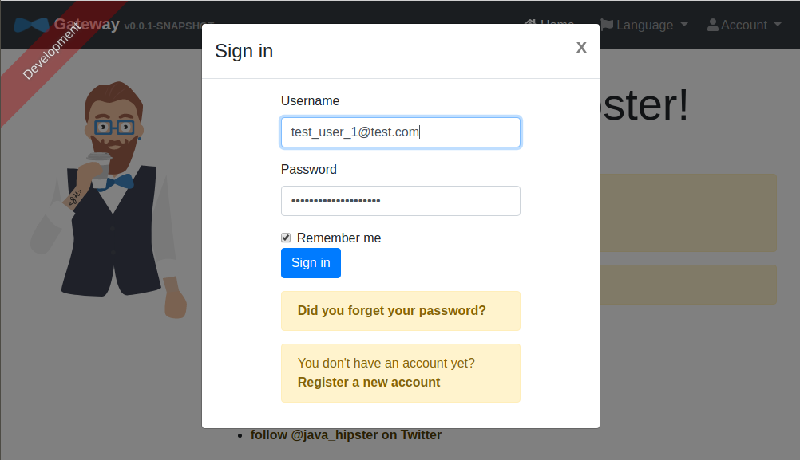
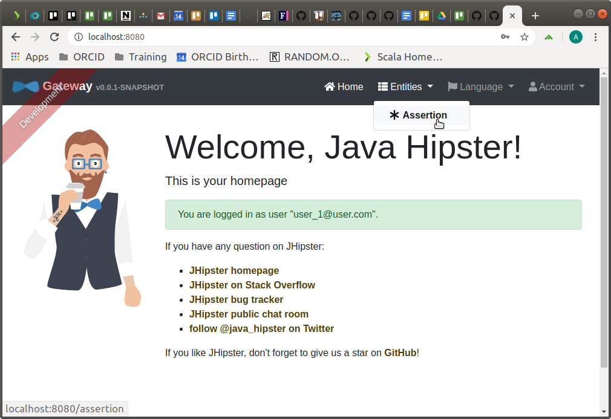
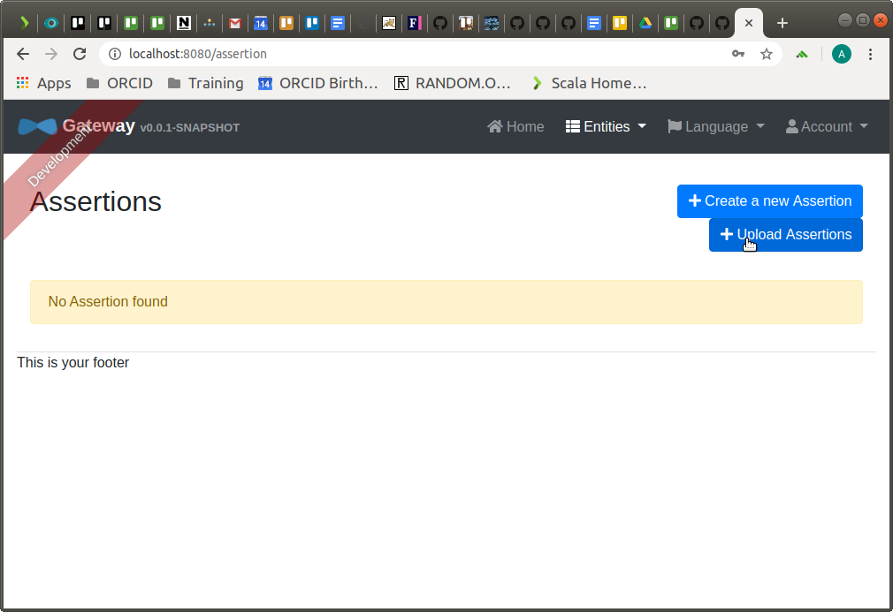
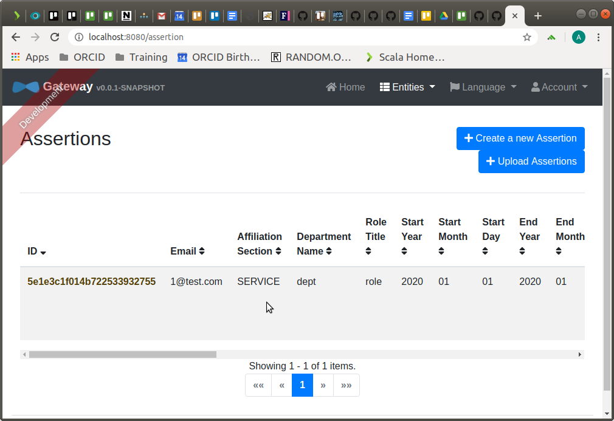

# Assertion services

## Prerequisites

Configure the orcid-mermber-services JHipster UAA services, as explained [here](README.md).

## Start the assertion-services

The `assertion-services` is the service that will allow us to CUD assertions (affiliations) in ORCID records, using this microservice, you will be able to create, update or delete assertions associated with specific ORCID records.

To start the `assertion-services`:

- Open a new terminal 
- cd orcid-member-services/assertion-services/
- Run `bash mvnw`
- Wait for it to start

## Test it

To test that the `assertion-services` is working as expected, we will go through the process of uploading an affiliation and wait until it get pushed to an ORCID record.

#### Create a new user
**2020/03/18 Creating a single user with ASSERTION_SERVICE_ENABLED doesn't currently work. To create a user with ASSERTION_SERVICE_ENABLED:**
1. [Create user with ASSERTION_SERVICE_ENABLED via CSV](https://github.com/ORCID/orcid-member-services/blob/master/USER_SETTINGS_SERVICE.md#create-multiple-users-from-csv)
2. The user will not have a password. To set on, send a reset request from the UI http://localhost:8080/reset/request
3. Reset email will not be sent, but will be displayed in oauth2-service console, ex:

		    <p>We&#39;re sorry that you are having problems signing in to your ORCID member tools account.</p>
		    <p>Please click the link below to reset your password. You can also copy and paste the link directly into your browser:</p>
		    <p>
			    <a style="color: #2E7F9F;"
				    href="http://127.0.0.1:8080/reset/finish?key=71878773678680222638">http://127.0.0.1:8080/reset/finish?key=71878773678680222638</a>
		    </p>

4. Use the reset link to reset the password.

OR just add ASSERTION_SERVICE_ENABLED authority to the user in in Oauth2Service.jhi_user

******* Not working *************************************************************************************

We will access the `assertion-services` functionality through the JHipster gateway, and, to be able to use it, we will need a user with the `ASSERTION_SERVICE_ENABLED` authority enabled, so, lets create a new user:

- Generate an access token as explained in [Create a user](#Create-a-user) section
- Use that token to create a user with the `ASSERTION_SERVICE_ENABLED` authority enabled:
```
curl -i -H "Accept: application/json" -H "Content-Type:application/json" -H "Authorization: Bearer <TOKEN>" -X POST --data '{"login":"test_user_1","email":"test_user_1@test.com", "firstName":"Angel", "lastName":"Montenegro", "password":"password123","authorities":["ROLE_USER","ASSERTION_SERVICE_ENABLED"],"salesforceId":"SF1", "parentSalesforceId":"PSF1"}'  http://localhost:8081/settings/api/user

```

#### Create an assertions file

Assertions can be manually entered into the assertion service app, or, they can be uploaded using a CSV file, that contains the following format:

 Column name | Description | Validation Rules
--------------------|--------------------------|--------------------------
 email | The email of the owner of the affiliation. | Required. Must be a valid email address. 
 affiliation-section | The section of the ORCID record to which the affiliation should be added. | Required. Must be one of the following values: <ul><li>employment</li><li>education</li><li>qualification</li><li>invited-position</li><li>distinction</li><limembership></li><li>service</li></ul>
department-name | The name of the department. | Optional. 4000 characters maximum. | 
role-title | Role/title/degree. | Optional. 4000 characters maximum. | 
start-date | The start date of the affiliation. | Optional. ISO 8601 date, with a least year specified, and at most day of month. Examples:<ul><li>2019</li><li>2019-02</li><li>2019-02-20</li></ul> | 
end-date | The end date of the affiliation. | Required if start-date is specified. ISO 8601 date, with a least year specified, and at most day of month. Examples:  <ul> <li>2019</li> <li>2019-02</li> <li>2019-02-20</li> </ul> |
org-name | The organization name | Required, 4000 characters |
org-country | The organization country | Required, iso-3166-country |
org-city | The organization city | Required, 4000 characters |
org-region | The organization region | Optional, 4000 characters |
disambiguated-organization-identifier | A persistent identifier for the organization that the affiliation is to. |   |
disambiguation-source | The type of the organization persistent identifier. | Required if disambiguated-organization-identifier is specified. Must be one of the following values:  <ul> <li>GRID</li> <li>RINGGOLD</li> <li>FUNDREF</li> <li>LEI</li> </ul> |
external-id | An identifier type used by the originating system | Optional.  One of existing external-id types - required if external-id-type is present |
external-id-type | An identifier for this affiliation in the originating system | Optional - required if external-id is present |
external-id-url | |

There is an example CSV file [here](./README/test.csv).

#### Login to the gateway app



#### Upload the assertions file






#### Review the existing assertions


